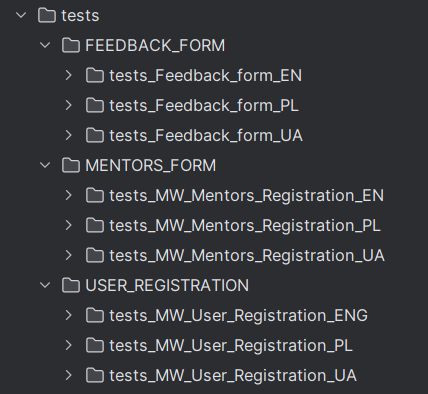

## A training project for learning Playwright and Python. Implemented verifications for 3 forms.

<div style="display: flex; justify-content: center;">
    
    
</div>

<div style="text-align: center;">
    
</div>
<br><br>

> Created verifications to test each field in each form. I split the tests into en pl ua, taking into account the localization of the website.



To run the project on your computer, install:

1. [PyCharm](https://www.jetbrains.com/pycharm/)

2. [Python](https://www.python.org/)

3. [Git](https://git-scm.com/) (clone the project)

4. Open project and run commands in the terminal:
```
pip install pytest

pip install playwright

playwright install
```
5. Update Python packages if necessary
6. Add an interpreter and install packages
```
pytest-base-url

pytest-playwright
```

7. Run tests
8. Run all tests, enter the command in the terminal:

```
pytest
```